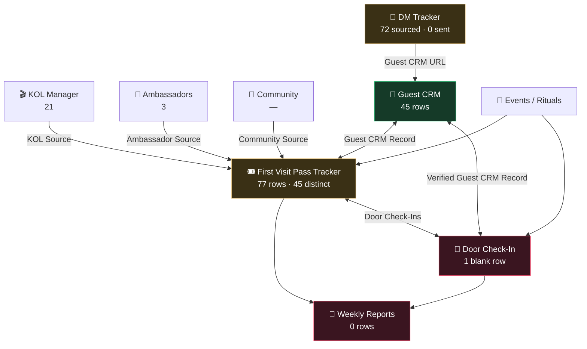

# Notion Workspace Architecture

**Mapped:** 8 August 2026, live via the Notion API.
**Workspace:** Mr.Troopers Office (`2b6b35c3-fd42-8169-a835-00035c19980e`)
**Method:** read-only. Row counts are live SQL against each data source.

---

## 1. It's an agency workspace, not a Season KL workspace

Season KL is **one client inside a multi-client agency workspace**. Also present: `MONO Malaysia`, `Troopers Brain`, and the CyberTrooper parent brand. This matters for the cleanup: anything scoped "delete everything not Season KL" would destroy other clients' work.

---

## 2. Two trees, deliberately separated

The design splits a **client-safe** surface from an **internal engine room**. That separation is sound and worth preserving.

### Tree A — client-facing
```
Welcome to Cyber Trooper
 └─ (blank title)
     └─ Start Your Journey
         └─ (blank title) ×3
             └─ Home
                 └─ Client Portal
                     └─ 🌏 Season KL — OS          ← the client hub
                         ├─ Season KL — Command Center
                         ├─ Season KL — Live Operating Dashboard  (inline db)
                         ├─ Season KL — KOLs
                         ├─ Season KL — Ambassadors
                         ├─ Season KL — First Visit Pass
                         ├─ Season KL — CRM / RSVPs
                         └─ Season KL — Weekly Reports
```

⚠️ **The client hub sits nine ancestor levels deep, and four of those ancestors have blank titles.** The path to your most important client-facing page cannot be read or navigated by name.

### Tree B — internal
```
Seasonkl — Client Engine Rooms          ← note: breaks the "Season KL — " naming convention
 └─ 🔒 Season KL — PRIVATE
     ├─ 🎟️ First Visit Pass Tracker
     ├─ 🚪 Door Check-In & Attendance Log
     ├─ 👤 Guest CRM / Filler Crowd Pipeline
     ├─ 📲 First Visit DM Tracker
     ├─ 🎬 KOL Campaign Manager
     ├─ 🌸 Ambassador Tracker
     ├─ 🍾 Table Bookings
     ├─ 🎡 Wheel Spins
     ├─ 📊 Crowd Stream Tracker
     └─ 📅 Weekly Reports
```

---

## 3. The databases — and what's actually in them

| Database | Data source | Rows | State |
|---|---|---|---|
| First Visit Pass Tracker | `107ad85b…` | **77** (45 distinct) | ⚠️ 30 duplicates |
| Guest CRM / Filler Crowd Pipeline | `9a5082db…` | **45** | ✅ clean |
| First Visit DM Tracker | `b173c8a5…` | **72** | ⚠️ all `Sourced`, 0 sent |
| KOL Campaign Manager | `d697330a…` | **21** | ⚠️ Supabase has 1 |
| Ambassador Tracker | `b9d4f85e…` | **3** | ✅ matches Supabase |
| Door Check-In & Attendance Log | `099e20b5…` | **1** | ❌ blank placeholder |
| Weekly Reports | `647a0ea9…` | **0** | ❌ never used |
| Events / Rituals | `b0be9d22…` | — | referenced by relations |
| Community / Partner | `4031bb34…` | — | referenced by relations |
| Table Bookings | *(page `0f467edb…`)* | — | Supabase holds 2 |
| Wheel Spins | *(page `e7bbe2a7…`)* | — | Supabase holds 8 |

---

## 4. How it's wired — hub and spoke

**Guest CRM is the hub.** Everything else relates back to it, so one guest record accumulates their whole history.



Every attribution path — DM, KOL, Ambassador, Community — converges on the Pass Tracker, which links to both the CRM and the Door log, and both feed Weekly Reports. **The design is genuinely good.** It is the schema you'd draw on a whiteboard if asked to make nightlife acquisition measurable end to end.

---

## 5. The proof chain — the clever part, and where it stops

Every record carries **Proof Status** and **Data Confidence** fields, so a row states how trustworthy it is rather than being silently assumed correct.

| Stage | Field value | Records that have reached it |
|---|---|---|
| 1. Issued | `Issued` | ✅ 45 |
| 2. Supabase Synced | `Supabase Synced` | ✅ 75 rows *(inflated by duplicates)* |
| 3. WhatsApp Confirmed | `WhatsApp Confirmed` | not verified this pass |
| 4. **Door Redeemed** | `Door Redeemed` | **0** |
| 5. **Reported** | `Reported` | **0** |

`Data Confidence` offers `Verified · Demo-Live · Partial · Unverified` — an honest instrument, built to distinguish real records from test ones.

**The chain has five stages. The last two have never recorded a single row.** Everything upstream works; the two stages that would prove revenue have never fired.

---

## 6. What writes into it

Ten Supabase edge functions, plus manual entry and Notion forms.

| Writer | Target | Status |
|---|---|---|
| `sync-season-kl` v26 | Guest CRM, Pass Tracker | ⚠️ produces duplicates |
| `notion-retry` v20 | retries failed writes | ❌ **probable duplication source** |
| `issue-season-pass` v19 | Pass Tracker | ✅ |
| `notion-sync` v15 | legacy — target unconfirmed | ⚠️ still ACTIVE |
| `dm-tracker-match` v4 | DM Tracker | ✅ verified by test |
| `dm-link-open` v2 | DM Tracker → `Link Opened` | ✅ built |
| `submit-ambassador` v2 | Ambassador Tracker | ✅ |
| `acceptance-mailer` v3 | Ambassador / KOL status | ✅ |
| `send-pass-email` v7 | pass email status | ✅ |
| `alicia-chat` v18 | none known | — |

**Notion-native forms** (no engineering needed to use):
- 🚪 **Season KL Door Check-In** — full attendance capture. Never opened.
- 🎟️ **First Visit Pass Issue Form** — manual pass creation.
- 📲 DM Tracker views: `Daily DM Queue`, `Follow-ups`, `Pipeline` board.

---

## 7. Cross-system reconciliation

The first time these two systems have been compared:

| Entity | Supabase | Notion | Δ |
|---|---|---|---|
| Passes | 51 | 45 distinct / 77 rows | **−6 missing, +30 dupes** |
| Guest CRM | — | 45 | matches distinct passes ✅ |
| Ambassadors | 3 | 3 | ✅ |
| **KOLs** | **1** | **21** | **+20 Notion-only** |
| Weekly reports | — | 0 | ❌ |

**The KOL gap is new.** Notion holds 21 creator records; Supabase holds 1. Those 20 were entered by hand — almost certainly from the 152-account DM campaign — and exist in no automated system. They will not appear in any Supabase-derived report, including this project's own live campaign report.

---

## 8. Assessment

**The build quality is high.** Hub-and-spoke relations, a five-stage proof chain, per-record confidence grading, working forms, and a clean client/internal split. It is more sophisticated than `STRATEGY.md` claims, and materially better than the website's own instrumentation.

**Three things undermine it:**

1. **Nothing reconciles the two systems.** Supabase says "synced" and nobody checks. That is how 30 duplicates and 6 losses went unnoticed for six weeks.
2. **The last two proof stages have never been used.** Door Check-In and Weekly Reports are both built, both wired, both empty. The chain is complete in design and truncated in practice.
3. **Manual entry bypasses the automation.** 20 KOLs and 152 DMs live outside every system that would report on them.

**The pattern across all three:** this is not a build problem. Everything needed is built. It is an operations problem — the tools exist and are not being opened.

---

## Appendix — data source IDs

```
107ad85b-a91f-4b69-a4b6-e279598329ec   First Visit Pass Tracker
9a5082db-9ff3-4331-94ef-e4a6f8207957   Guest CRM / Filler Crowd Pipeline
b173c8a5-e959-4c24-a374-4777e1c8fcd3   First Visit DM Tracker
099e20b5-d29c-495b-a224-c3ddb5cbaa0e   Door Check-In & Attendance Log
647a0ea9-a697-447e-ab46-75403c06d668   Weekly Reports
d697330a-70e4-48c1-8c07-cf1985ab7edf   KOL Campaign Manager
b9d4f85e-f535-428b-b24a-0392fb54ce72   Ambassador Tracker
b0be9d22-4c2d-4aed-b181-847aa03044b2   Events / Rituals
4031bb34-b262-4b7f-ab60-f565ae46c941   Community / Partner
```
